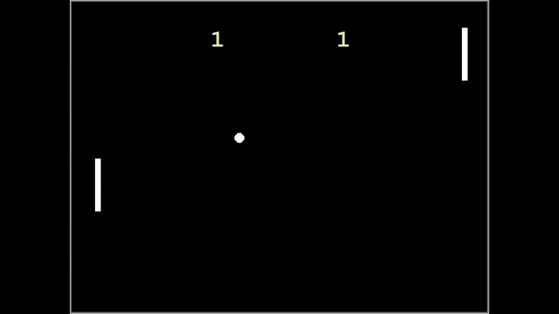

# ping-pong-game
A simple 2-player Ping Pong game built with Python's turtle module — practice for OOP, game loops, and basic collision logic.

---

## 🎮 How to Play

- **Player 1 (Left Paddle):**
  - `W` to move up  
  - `S` to move down  

- **Player 2 (Right Paddle):**
  - `↑` (Up arrow) to move up  
  - `↓` (Down arrow) to move down  

🎯 **First to reach 3 points wins the match!**

---

## 🚀 Features

- Object-Oriented Design (Ball, Paddle, Score classes)
- 2-player mode with separate controls
- Collision detection and bounce logic
- Scoring system with a win condition
- Python `turtle` graphics — no extra libraries needed

---

## Files Description

- main.py – Runs the game loop, handles screen setup, input controls, and game logic.
- paddle.py – Defines the Paddle class, including movement and position control for each player.
- ball.py – Defines the Ball class, including ball movement and direction handling.
- score.py – Manages the scoreboard, displays the current score, and game rules.

---

## 🛠️ How to Run

1. Make sure you have **Python 3.x** installed.
2. Run main.py from any Python IDE or terminal.

Or download the latest .exe from the Releases tab and double-click to play.
No Python installation required!
